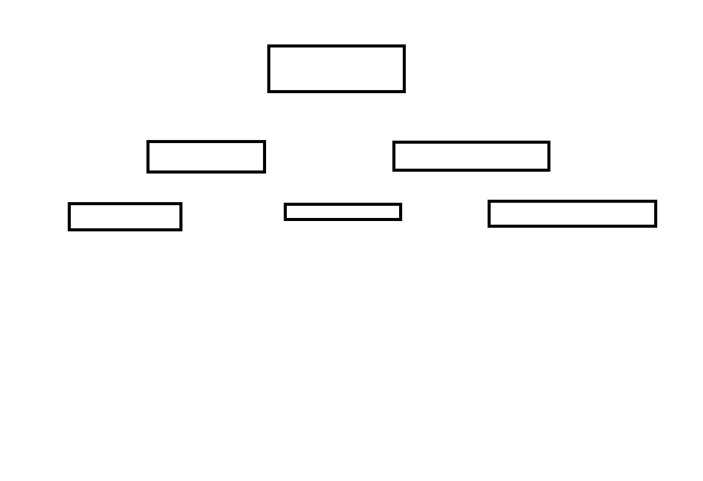

[comment]: <> (This is a comment, it will not be included)

### Código: CU-002
# Titulo: Proceso de venta
- **Versión del documento:** 1.0.0
- **Descripción:** Se dará de alta una venta en el sistema.
- **Secuencia Normal:** 
    - **Secuencia de Pasos:**
        1. El usuario ingresa a la pantalla correspondiente
        2. Selecciona en la opción Alta de Cliente
        3. ~~Asi hacemos el tachado, que podria usarse para deprecar algo~~
        
- **Secuencia Alternativa:**
    - **Secuencia de Pasos:**
        1. El usuario ingresa a la pantalla correspondiente
            - [ ] A
            - [x] B
            - [ ] C
        1. Selecciona en la opción Alta de Cliente
        1. ~~Asi hacemos el tachado, que podria usarse para deprecar algo~~
        
          
    
- **Dependencias:** Aca van las dependencias
- **Precondición:**
- **PostCondición:**
- **Excepciones:**
- **Comentarios:**

